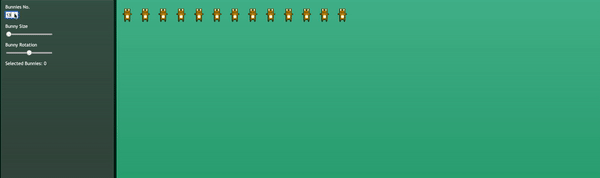

# Bunny PIXI.JS Task

### Starting the app for the very first time.

1. Make surre you are in the root directory.
2. Install all dependencies `npm install`.
3. Start the app `npm run start`.
4. Open `http://localhost:3000/` in your browser.
5. Enjoy ! 😁

### DEMO:

Author: Pawel Stanecki,
email: p.stanecki93@gmail.com
